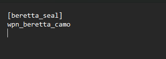

# **SEALs**

This mod is a simple configurator to add badges (seals) on the weapons icons in the inventory and tooltip.


Seals are meant to represet certifications of provenience, like modders tag, modpack exclusives, manufacturers, or technical support (3DSS etc.), mod support (Black Market, Loot boxes, etc) or specifics (unique weapon)   

At the end of the day is what you make out of it.

This mod is considered a community tool and is meant to be used by weapon's mod makers or modpack curators/maintainers or to support user's custom modlists.

# Techical aspects

The mod consist of main mod and configuration files modules

## The main mod

The main mod (under the hood) does the following:

- customizes the **Dynamic Icons Indicator** mod so it can apply seals as custom layers on the weapon icons 
- customizes the anomaly's inventory scripts to shows the seals on the item's tooltip as well

- customize the behavior of the mod itself (disable seals, icons scale, etc)

## The configuration module

is used to

- defines the seals (icon, caption)
- the list of weapon where the seals are displayed

## List of configuration modules

> [!CAUTION]
> These modules are provided as examples. 
> The mod is meant to be supported only by the community's contribuitions

- 3DSS: Applies 3DSS seals to all weapons that support this kind of scopes
- GAMMA: Applies seals to all available GAMMA weapons, such weapons are present in loadouts and can drop in game. This module also includes the 3DSS seals
- manufactorers: applies manufactorers seals to guns (this is an example mod)
- demo: Combine all the config modules in one, for demo purposes
- mods: applies mods related seals (this is an example mod)
- template: template config module meant to be used for creating new/custom seals configurations

# How to build

Launching the powershell `build_fomod` file in a windows terminal will build all the modules

```shell
./build_fomod.ps1
```

# How to install and requirements

You install the main mod and then one or any of the config modules of choice

The **SEALs** mod requirements are:

- [MCM Mod Configuration Menu](https://www.moddb.com/addons/anomaly-mod-configuration-menu)
- [Dynamic Icon Indicators](https://www.moddb.com/mods/stalker-anomaly/addons/dynamic-icon-indicators)
- [HD Inventory Icons Framework](https://www.moddb.com/mods/stalker-anomaly/addons/hd-inventory-icons-framework)

The **SEALs** mod must be installed below these 3 mods


# How to create customized seals

Start with the template config module

replace any reference of *template* with the name of your custom seal group


for example you want to create a seal to represent the **Beretta** manufacturer in the weapons

1) rename the `group_template.ltx` to `group_beretta.ltx`

2) open the `group_beretta.ltx` and change the seal name from `[template_seal]` to `[beretta_seal]`

## Edit the group

open `group_beretta.ltx` with the new beretta seal and add the sections where you want the seal to appear 

for example



## Edit the strings xml

open the `st_ui_beretta_seals` file and edit the mcm menu name and seal caption for when it is show in the tooltip

```xml
<?xml version="1.0" encoding="windows-1251"?>

<string_table>

	<!-- MCM menu item for Dynamic Icons Indicators mod -->
	<string id ="ui_mcm_dii_beretta_seal_show">
		<text>Beretta seal</text>
	</string>

	<!-- Caption string for the seal when displayed in the item tooltip, referenced in layer_template_seals.ltx -->
	<string id ="ui_seals_beretta">
		<text>Beretta</text>
	</string>			
</string_table>  
```

## Add the seal texture and the texture descriptions

1) Create the seal's texture and save it in `textures/ui`


The texture must be `.dds` and it's recommended that is 200x200 approx

2) edit the `ui_beretta_seals.xml` and define the texture's destriptor

```xml
<w>
	<!-- Template Seal texture, referenced in layer_template_seals.ltx -->
	<file name = "ui\beretta_seal">
		<texture id = "ui_seals_icon_beretta" 				x="0"	y="0"	width="200"	height="200" />	
	</file>				
</w>
```

## Edit the layer

open the `layer_beretta_seals.ltx` and define how the seal is displayed

```
[beretta_layer]						
texture = ui_seals_icon_beretta
icon_scale = 8
tooltip_scale = 4
group = beretta_seal
caption = ui_seals_beretta
anchor = left_top
align = relative
width = 25
margin_horz = 2
margin_vert = 2
```

you should leave everything by defaults, you can though change the scale properties depending on the size of the original texture.

for a 200x200 texture, the defaults are the best

```
icon_scale = 8
tooltip_scale = 4
```

for greater textures you should increase the scale factors or it will be too big in the UI

> [!TIP]
> In this tutorial we are only adding one seal, but you can add as many seals as you like starting from one single template module 
> For instance, check the following example modules: demo, mods, manufacturers 

## Packaging and deployment

Package everything into an archive where the gamedata folder is the root

Install in MO2, where the main mod and its requirements have already been installed

## Distribuiting in mods

If you are gunmod maker and you want to add custom seals to the be shown on the gun, lets say your personal badge or the manufacturer

- include the **SEALs** main mod in your mod
- include the **SEALs**'s config with your custom seals

> The user must have all the **SEALs** requirements installed

You can also include just the **SEALs**'s configs and add **SEALs** install instructions to your mod install instructions

> [!CAUTION]
> The capability to see the seals depends on the user that is installing the gun mod and its modlist
> In short if, it does not have all requirements installed, the seals won't show up

## Distribuiting in modlists

You are free to install **SEALs** in your modlist and separately maintain the **SEALs**'s configs in mods or repositories


