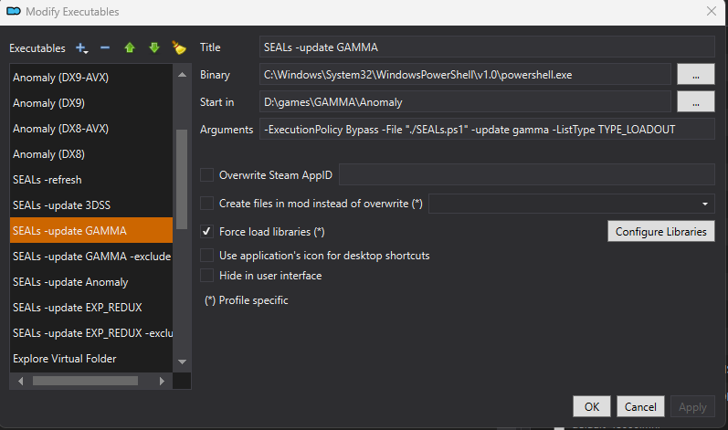
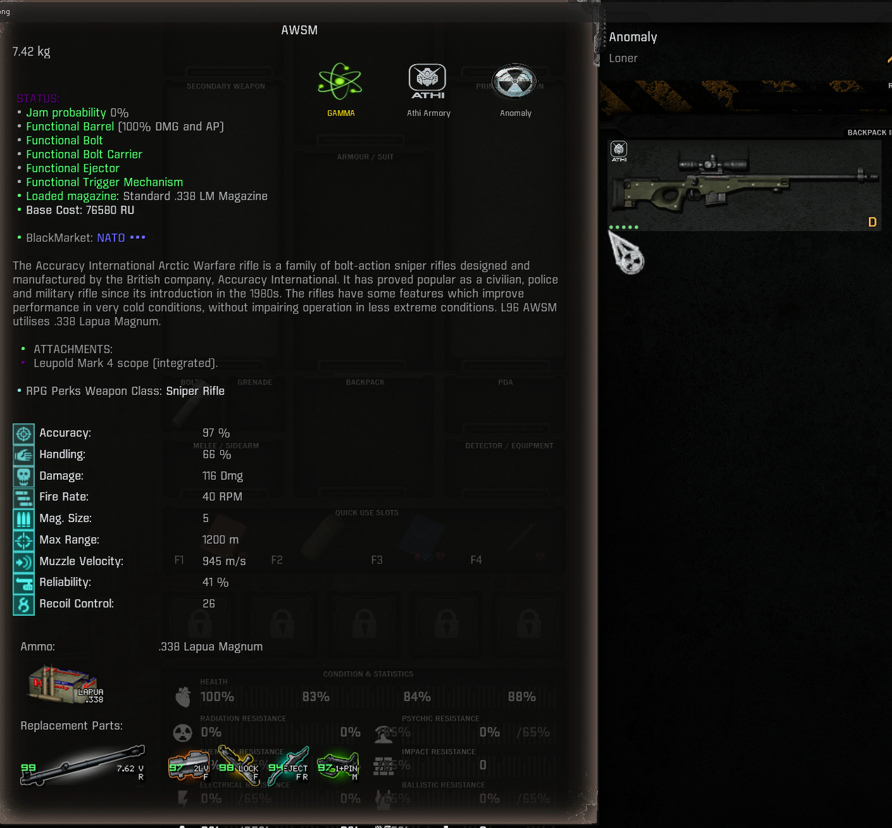

# **SEALs**


This mod is a simple configurator to add badges (seals) on the weapons icons in the inventory and tooltips.


Seals are meant to represent certifications of provenience, like modders tag, modpack exclusives, manufacturers, or features support (3DSS etc.), mod support (Black Market, Loot boxes, etc) or qualities (unique weapons, quest rewards, etc)   

At the end of the day is what you make out of it.

A brief video showcasing the mod in action

[](https://youtu.be/U77XatOafVU)

>[!TIP]
> This mod is considered a community tool and is meant to be used by weapon's mod makers or modpack curators/maintainers or to support user's custom modlists.

# Technical aspects


The addon consist of the main module, a CLI for templating and generating/updating weapons' (sections) lists and several prefab configuration modules

## The main module

The main mod (under the hood) does the following:

- reworks the **Dynamic Icons Indicator** mod so that it can apply seals as custom layers on the weapon icons 

- customizes the anomaly's inventory scripts to shows the seals on the item's tooltip as well

- customize the behavior of the mod itself (disable seals, icons scale, etc)

An introductory tutorial (**NPE Framework**) is also included.
 
## The configuration module

is used to

- defines the seals (icon, caption)
- the list of weapon where the seals are displayed

## List of configuration modules

>[!CAUTION]
> The configs modules are available at their repository [SEALs-Config](https://github.com/strangerism/SEALs-Config)

Here are few of them listed:

- **Anomaly**: Applies Anomaly seals to all weapons from the base game (this is a static prefab configuration).

- **3DSS**: Applies 3DSS seals to all weapons that support this kind of scopes (this is a blank prefab configuration ready to be compiled with data).

- **GAMMA**: Applies seals to all available GAMMA weapons, such weapons are present in loadouts and can drop in game (this is a blank prefab configuration ready to be compiled with data).

- **manufacturer**: applies manufacturer seals to guns (this is an example of static configuration)

> **static configuration** are mainly manually edited (e.g. guns added manually to a list) in contrast to the use of generation tools, that we will see below, which can dynamically compile these lists by scanning mod folders or the entire modlist.

## The CLI

The **CLI**, an interactive powershell script, is used to create new config modules, blank or already compiled with data from mods. Data is generated dynamically scanning mods folders or entire modlists.

You execute its commands from the windows terminal

e.g.

```powershell
SEALs.ps1 -new cod4 -from "3DSS COD4-MW Weapon Pack"
```

or as **Mod Organizer 2** Executables

e.g.


## How to build this project

By launching the powershell `build.ps1` file in a windows terminal will build all the modules as above.

```shell
./build.ps1
```

# How to install and requirements


**SEALs** is a "spin" or total rework of **Dynamic Icons Indicator**, you don't need this mod installed to use **SEALs** but you will need it if you want the **Dynamic Icons Indicator** funtionalities. 

[Dynamic Icons Indicator](https://www.moddb.com/mods/stalker-anomaly/addons/dynamic-icon-indicators)

> [!CAUTION]
> **SEALs** does not replace **Dynamic Icons Indicator**

You install the main mod and then one or any of the config modules of choice.

The **SEALs** mod only requirement are

- [MCM Mod Configuration Menu](https://www.moddb.com/addons/anomaly-mod-configuration-menu)

- [OPTIONAL] [NPE Framework](https://github.com/strangerism/New-Player-Experience) for the tutorial

## Two distinct use cases

### End User

The end user will only need to install **SEALs** main module and one or more config modules. This will allow SEALs to display badges (or seals) over the weapons's icons in game.


### Modder - Modlist customizer

The mod creator that wants to create/add seals to his gun mod or modlist, must install the main module, the CLI module, the config Anomaly module (optionally) and the config template module. This will allow to create new seals or update/maintain current ones.


## Mod Configuration

**SEALs** has a configuration MCM menu where you can configure its behaviour.


The main one is toggling the UI. By holding a key, you can turn on/off the visualization of the seals on the weapon's icons. You can change this keybinding in the MCM menus.


You can change the aspects of seals (scale, positions, offset etc) in both tooltips and icons. 

Additionally each seal can be disabled separately.


# How to use the SEALs CLI


The **SEALs CLI** is a script (porwershell) that you can execute in a windows terminal. It offers the following functions:

- to create new **SEALs** seals config modules from a template
- to populate **SEALs** seals's config modules ***group list*** from existing gun mods
- to generate seals configs data from the modlists VFS
- to generate seals 3DSS configs from the modlists VFS

an example of group list `seals_group_gamma.ltx`

```
[gamma]
wpn_9a91
wpn_abakan_n
wpn_ace52
wpn_adar2_15
wpn_aek
wpn_ak101
wpn_ak103
....

```

The **SEALs** main mod uses the ***group list*** from the configs modules to display seals icons on the gun that are listed in such list.

## Installing CLI

1) Install the `SEALs_CLI.zip` addon in **MO2**.


>[!CAUTION]
> the mod name it's important. It must be named `SEALs_CLI`
> you can use a different name but you must edit the default name in `CLI.ini`

2) Open the *SEALs - CLI* mod folder in **MO2** and and copy in the clipboard the path to the folder.


3) Add this path as a new *Windows environment variable*.


4) Add the **SEALS_CLI** to the PATH environment variable with `%SEALS_CLI%`


## Templating

CLI allows you to create named configs projects from templates. These projects or mod, will be empty and require the compilation of the **group list** inside. Such compilation can be done manually or automatically through CLI geneneration functions.

1) install a template module in MO2.


2) rename the template mod in MO2 with a name of your choice, e.g. `SEALs Configs - COD4 Modern Warfare Weapon Pack`.


3) open the renamed mod folder in explorer.


4) open the `template.ini` inside and edit the properties within.

	`sealid`: it's the id of the group list in this config module

	`sealmcm`: it's the tab name in the MCM menu for this module

	`sealmcm_desc`: it's the hint displayed when hovering over the seal option in mcm

	`sealcaption`: it's the seal's caption that will appear in the item detail's tooltip

	e.g. 
	```
	sealid=cod4
	sealmcm=COD4 Modern Warfare
	sealmcm_desc=A porting of all guns from COD4 Modern Warfare
	sealcaption=COD4 Modern Warfare
	```
	
	save the changes and exit.

5) open a terminal in windows to the `SEALs Configs - COD4 Modern Warfare Weapon Pack` mod folder 

6) use the CLI `new` command to create a new template config from a gun mod e.g. `3DSS COD4-MW Weapon Pack`


```powershell
SEALs.ps1 -new cod4 -from "3DSS COD4-MW Weapon Pack"
```

7) you can now add more group sections to this config mod using `add` from different gun mods

e.g.

```powershell
SEALs.ps1 -add cod4 -from "3DSS COD4 Gold Desert Eagle"
```

## Templating commands summary 

### CLI new

```powershell
SEALs.ps1 -new <sealid>
```

Creates an new blank **SEALs** config mod

### CLI new from mod

```powershell
SEALs.ps1 -new <sealid> -from "<mod_name>"
```

Creates and compile the **SEALs** config mod group sections from within the mod (from loadouts files)

### CLI add from mod

```powershell
SEALs.ps1 -add <sealid> -from "<mod_name>"
```

Add to the group config new gun sections from a mod (from loadouts files)

### CLI add from modlist file

Add can be used with a file that contains a list of mods to populate the group list from each

The file must be named `modslist.txt` and be present in the mod folder


Run the command add followed by sealid and the CLI will look for the `modslist.txt` file instead 

```powershell
SEALs.ps1 -add <sealid>
```

### CLI ListType

By default all the group list are generated by scanning data from weapon base files (e.g. `w_{{weapon-name}}.ltx`). These types of list are named `TYPE_BASE`

You can generate weapon group lists using these lists types:

- `TYPE_BASE`: generates from base weapon files
- `TYPE_LOADOUT`: generate from loadout files and treasure caches
- `TYPE_TRADE`: generates from trade files
- `TYPE_OVERRIDE`: generates from mod's overrides files (e.g. `mod_system_{{mod-name}}.ltx`)

Special kind of list types:

These list types are used to generate not weapon groups but 3dss group lists or scope group lists

- `TYPE_3DSS`: generates from 3DSS files
- `TYPE_ADDON`: generates from weapons's addons files

Use ListType parametes to specify a list type

```powershell
SEALs.ps1 -add <sealid> -from "<mod_name>" -ListType TYPE_LOADOUT
```

>[!CAUTION]
>not all commands support all List Types

In the above example we speficied TYPE_LOADOUT instead of TYPE_BASE (default one) so we add from the loadouts lists that are in the mod not the weapon base files.  

### CLI clear

```powershell
SEALs.ps1 -clear <sealid>
```

Wipes clean the named group list.

If you think you made a mistake, use clear and start over.

## Generation

While SEALs templating is limited to create blank configs or single mod configs, with generation you can generate configs from the entire modlist content.

To do this, the SEALs CLI must be run while the MO2's profile VFS is running at the same time. This it's done by creating SEALs CLI executable in MO2.


### Prefab config modules for generation

**SEALs** ships with two prefab config modules that can be used with modlist.

- **SEALs Config - GAMMA**: a prefab config for the **GAMMA** modlist, with this config when populated, **SEALs** will tag all the guns with the GAMMA icon.

- **SEALs Config - 3DSS**: a prefab config for **3DSS** mod, with this config when populated, **SEALs** will tag all the guns with the 3DSS icon.

Both are empty and need to be compiled with data from the modlist. Let's look how to configure CLI in MO2 to generate data for them.

### CLI GAMMA generation

To use **CLI** to generate such group list you pass the name `gamma` alongside with the `update|generate` switches and `-ListType TYPE_LOADOUT`

e.g.

```powershell
SEALs.ps1 -update gamma -ListType TYPE_LOADOUT
```

>[!TIP]
> Create this shortcut in MO2 now

#### Update GAMMA



`-ExecutionPolicy Bypass -File "SEALs.ps1" -update gamma -ListType TYPE_LOADOUT`

>[!CAUTION]


remember you need all the mod installed before proceeding with the execution of this shortcut. The tutorial section, next, will show how to run.

### CLI 3DSS generation

The 3DSS group list is a reserved name. 

To use **CLI** to generate such group list you pass the name `3dss` alongside with the `update|generate` switches

e.g.

```powershell
SEALs.ps1 -update 3dss
```

>[!TIP]
> Create this shortcut in MO2 now

#### Update 3DSS


`-ExecutionPolicy Bypass -File "./SEALs.ps1" -update 3dss`

### Configuration prefab

These modules contain modlist data already compiled, which can be used as is but can be also used are reference data during the generation of other modules configs

- **SEALs Config - Anomaly**: a prefab config with populated group list that reference all the guns present in **Anomaly** VANILLA. With this config only, SEALs will tag all the guns with the Anomaly seal icon   

## Generation commands summary 

You can use the CLI in the MO2 VFS with only two commands (update|generate)

> [!CAUTION]
> Don't use in terminal, these are meant to be used in MO2 executable configurations

### CLI update

```powershell
"./SEALs.ps1" -update <group_for_updating> -ListType <list_type> -exclude -groups <groups_for_exclusion>
```

for example

Assuming you are on the stock gamma profile, with the following command, you will generate a group list that includes the guns that GAMMA alone adds to Anomaly vanilla set of guns. 

```powershell
"./SEALs.ps1" -update gamma -exclude -groups anomaly
```

the command above (when run in VFS) will update the gamma group list `seals_group_gamma.ltx`, contained in the **SEALs Config - GAMMA** mod, with all the available guns in GAMMA, e.g. present in loot tables or referenced for drops or rewards. 

However, the presence of the `exclude` parameter which references the `anomaly` group list (from **SEALs Config - Anomaly** ) means that all entries from that grouplist will be filtered out from the final `gamma` group list of the update command

### CLI generate

if you use `generate` instead of `update`, the group list in **SEALs Config - GAMMA** is not modified, instead the output is written in the **GAMMA** `overwrite` folder 

e.g.

```powershell
-generate gamma
```

### CLI nocache option

CLI commands need to build a number of base list to fully operate and sort the output data. 

One of such list (e.g. scopes), once built are cached on subsequent command execution. 

However these lists are dependent on the content of the modlist, so if you change the profile in MO2 or add mods to the current modlist you should rebuild the cache.

To rebuild these lists, you can use the -nocache option at the first command on the update/new modlist

e.g.

```powershell
-generate gamma -nocache
```

or delete the cached files directly at 

`overwrite\generation\cache`

### CLI cache

The CLI cache can be reconstructed any time by running `-cache` as MO2 executable shortcut


```powershell
"./SEALs.ps1" -cache
```

### CLI rarity

You can run a summary report on the npc loadouts for the spawn chances of weapons.

The analysis is done on the VFS at launch, so you need to execute this command with as an MO2 shortcut


`-ExecutionPolicy Bypass -File "SEALs.ps1" -rarity gamma`

> rarity needs the output from a previous generation, so run one before running rarity

The reports are:


- `weapons_chances.csv`: maximum spawn chance of each weapons per faction
- `weapons_grouped_by_chance.ltx`: weapons' list sorted by spawn chance 

## CLI Logging

CLI will log all commands to files and create several summary reports 

### Logs locations

Depending on how how you use CLI the logs location might differ:

- running CLI from terminal, e.g. during **Templating**

	CLI will log in the folder where the terminal is launched inside the `generation` folder

- running CLI from VFS, e.g. launching MO2 shortcut

	CLI will log in the MO2 `overwrite` folder

### Main log

CLI logs the latest command execution in `generation\output\seals.log`

### Summary report logs

CLI logs the summary report of the latest generation in its named folder `sealid`:

- `overwrite\generation\output\sealid\` contains generated weapon lists and the following folders below

- `overwrite\generation\output\sealid\hit` contains report of all the file hits when searching for sections

- `overwrite\generation\output\sealid\hit\files` contains the loadout files that have been used as input for the generation. These are pulled from the MO2 VFS mount at launch. 

- `overwrite\generation\output\sealid\miss` contains report of all the file miss when searching for sections

- `overwrite\generation\output\sealid\miss\files` contains all the files that recorded a miss

## CLI Tutorials


### 1. How to update the SEALs Config - GAMMA

1) be on the **default** GAMMA profile in MO2

2) install and enable all the necessary SEALs mods


3) run the CLI executable *SEALs -update GAMMA* in MO2 


4) the gamma group list file in the mod is updated 


`SEALs Config - GAMMA\gamedata\configs\custom_seal_layers\groups\seals_group_gamma.ltx`

```
[gamma]
wpn_9a91
wpn_abakan_n
wpn_ace52
wpn_adar2_15
wpn_aek
wpn_ak101
wpn_ak103
wpn_ak104_alfa
```

> [!TIP]
> if you run the update with the **SEALs Config - Anomaly** enabled, you can use the `-exclude anomaly` to generate in the group list with the only the weapons that are exclusive to **GAMMA**    

### 2. How to update the SEALs Config - 3DSS

1) be on any profile

2) install and enable all the necessary SEALs mods


3) run the CLI executable *SEALs -update 3dss* in MO2 


4) the 3dss group list file in the mod is updated 

`SEALs Config - 3DSS\gamedata\configs\custom_seal_layers\groups\seals_group_3dss.ltx`

```
[3dss]
wpn_9a91
wpn_abakan_n
wpn_ace52
wpn_adar2_15
wpn_aek
wpn_ak101
wpn_ak103
wpn_ak104_alfa
```

### 3. How to generate SEALs group lists for your custom modlist

1) be on your custom profile e.g. `exp_redux`

2) install and enable all the necessary SEALs mods


3) create a new **blank** SEALs template using CLI `new`

```powershell
SEALs.ps1 -new exp_redux
```
>[!TIP]
> follow the ***templating*** guide above for all the steps, like editing template.ini etc.

now you should have a blank SEALs mod in MO2 which can name **SEALs Config - EXP Redux**

3) create a MO2 executable for your modlist 


3) run the CLI executable just created 


4) the exp_redux group list file in the blank mod is now compiled  

`SEALs Config - EXP Redux\gamedata\configs\custom_seal_layers\groups\seals_group_exp_redux.ltx`

```
[exp_redux]
wpn_9a91
wpn_abakan_n
wpn_ace52
wpn_adar2_15
wpn_aek
wpn_ak101
wpn_ak103
wpn_ak104_alfa
```

### 4. How to generate exclusive group list and seals for it

You can use CLI `-exclude` option to update/generate exclusive lists. 

For example you have a custom GAMMA modlist and you have both the **SEALs Config - Anomaly** and **SEALs Config - GAMMA** enabled which applies the Anomaly seals to all the Anomaly guns, but also the GAMMA seal to GAMMA ***enabled*** guns.

However you want to create a new seals that tags all guns you have installed on top of these guns. 

You can create a new SEAL group list as shown in the tutorial 3, but you use the exlude option when generating the group list

For this you must create a new MO2 executable or modify the first one in tutorial 3


1) run the CLI executable with the exclude directive

2) the exp_redux group list file in the blank mod is now compiled but it will be shorter than when originally done at tutorial 3

```
[exp_redux]
wpn_aa12
wpn_ak101_sp
wpn_ak101vgrip
wpn_ak103_bp
wpn_ak105_sp
wpn_ak12_mono_com
wpn_ak74uvgrip
```

3) you will also need to create a custom icon texture that will be used as SEAL. This will be explained in the next chapter below

# Anatomy of a SEALs config module


The SEALs config is a ***scaffolding*** type of mod which, as we have seen by now, it's used to hold guns lists and other information needed to display custom seal in game for those guns in the list. 

The files within the SEALs config mod have a special purpose which will be explained here. 

To start, first install a SEAL template and open the mod folder in explorer. 

You will see the content of the mod as such 


This is the agnostic form of the config mod or simply scaffold. Files are named with the `default` token and files inside will have tokens. This form is used by the CLI `new` command to create ***concrete*** config mod with names of your choice. 

We will look in detail at each file and what they are used for, before doing use the `-new` to create an `example` group list config

run ***CLI*** `-new`

```powershell
SEALs.ps1 -new example
```

Now all files' names have been tokenized with the `example` group list name and same with their content 


## The group list file

`seals_group_example.ltx`

The first most important file is the group list file and the only file that is manually or dynamically updated at your will

In this example it's empty since we run `-new` to create a blank config module, we could have initialized with some mod data with `-from` parameter otherwise

## The texture file

`seals_icon_example.dds`

The texture file is the second most important file since you will want to have a new custom icon as seal for the config module. The templating process creates a default texture but you can change it with yours. The important is to keep the name the same and some rules regarding the texture format and size.

- name should be kept as is. Changing the name of this file must be reflected in the texture descriptor file xml file we see next.
- the format must be ***dds***
- the size should be 200x200. If any other size is used then some edits are required in the seals layer config file and texture descriptor file

## The texture descriptor file

`ui_seals_example.xml`

This files reflects the details of the texture files, like size and name. 

```xml
<w>
	<!-- seal icon texture descriptor -->
	<file name = "ui\seals_icon_example">
		<texture id = "ui_seals_icon_example" 				x="0"	y="0"	width="200"	height="200" />	
	</file>				
</w>

```

If you use a bigger texture, which you can, you need to update the `width` and `height` params accordingly

## The SEAL layer config

`seals_layer_example.ltx`

This file is concerned in the way the icon is displayed in the UI in game.

```ini
[example]
primary=false
group = example
texture = ui_seals_icon_example
icon_scale = 8
tooltip_scale = 4
caption = ui_seals_example_caption
```

If you keep with defaults with other files then you don't need to change anything here.

However if you used a bigger texture size than the ***default 200x200***, you must edit the `icon_scale` and `tooltip_scale` by the same factor

for example if your texture is 400x400 instead, then you need to change 

```ini
icon_scale = 16
tooltip_scale = 8
```

### Primary seal

If you set `primary` to ***true*** the seal will be considered a primary seal. Primary seals will be showed alwas as first (from the left) in the weapon icons and in tootips the caption text will be gold colored 

A weapon can show multiple seals but only one can be the primary one.

For instance, the anomaly seal is configured as primary seal


### Override seal

You can use the `overrides` directive to take the place of other seals in the weapon's icon

For example the gamma seal is configured to override the anomaly seal

```ini
[gamma]
group = gamma
primary=true
overrides=anomaly
texture = ui_seals_icon_gamma
```

The `override` directive must reference the group name to which it wants to override. 

The value taken it's a csv array. e.g. `overrides=anomaly,bas`

You can also set `overrides` in the mcm menu, doing so it will override the default values set in the layer config if they exists.


Overrides, in practice, allows to hide other layers (seal icons) when they are present at the same time.



For example, the group list ATHI overrides the gamma seals which in turn is set to override the anomaly seals. Results both, anomaly and gamma seals are missing from the gun icon, although they still are visible in the tooltip.

### settings group

The **SEALs** MCM menu groups the seals settings by tabs, by default a new custom seals in placed always in the main tab. However you can change this by either reusing a prefab tab from the main mod, a tab from a different SEALs config module, or your own custom tab.

You specify the tab with the `settings_group` directive

settings_group = <tabid>/<sealid>

e.g.

```ini
[3dss]
group = 3dss
texture = ui_seals_icon_3dss
icon_scale = 8
tooltip_scale = 4
caption = ui_seals_3dss_caption
settings_group = scope/3dss
```

The tabid is as defined in the string files (see next)

## The UI strings file

`st_ui_seals_example.xml`

This file define the strings used by the custom seal mainly two string

- the seal MCM menu string

- the seal caption string 

- a custom MCM menu tab

```xml
<?xml version="1.0" encoding="windows-1251"?>

<string_table>
	<!-- mcm tab/group -->
	<string id ="ui_mcm_menu_seals_custom_layers_scope">
		<text>Scope</text>
	</string>	
	<!-- seal mcm toggle -->
	<string id ="ui_mcm_seals_3dss">
		<text>3DSS (3dss)</text>
	</string>
	<string id ="ui_mcm_seals_3dss_desc">
		<text>This seal signifies that the weapon has built-in 3DSS support</text>
	</string>			
	<!-- seal caption -->
	<string id ="ui_seals_3dss_caption">
		<text>3D Scopes</text>
	</string>			
</string_table>  
```

If you used the ***CLI*** templating, you have already set the first two strings in the `template.ini`

the mcm/tab group defines the tabid as

`ui_mcm_menu_seals_custom_layers_tabid`

# SEALs Distribuition

## Standalone Seals Configs distribuition

If you are gun mod maker and you want to add custom seals to the be shown on the gun you make, lets say your personal badge or the manufacturer.

You have several options on how to distribuite your seals

1. Distribuite a single SEALs config module that contains all your guns seals

2. Embeed the relevant SEALs config module in your gun mod directly

3. Embeed both the SEAL main module and your gun SEALs configs in your gun mod

The first 2 options are the most recommended but also rely on the user having installed SEALs main mod in his modlist, which you can always add (encourage) in your install mod instructions

The third option is the fully standalone solution but as you might expect is the less recommended for obvious reason. So avoid it, if you can. 

I do not prohibit you however to distribuite the SEALs main mod with your mod files but there could be bad effects doing so on the user side if you do so, so be mindful of this and respectful of the users needs as well.

## Distribuiting in modlists

You are free to install **SEALs** in your modlist and separately maintain the **SEALs**'s configs in mods or repositories

# Maintaining SEALs

## **Modpack Curators**

As a modpack curator, for yourself or for open distribuition, you are constantly adding new guns or altering the gameplay balance (e.g. updating the loadouts) therefore you will be maintaining the **SEALs** lists as consequence.

The best approach is to keep the **SEALs** mod separated from the **SEALs** configs you create. Use the CLI to keep updated these configs and commit to the repositories (if you use these) only the configs but not the CLI itself.

## **Modpack Users**

If assumingly there will be modpacks that makes use of SEALs, as a user that adds new guns you want to make sure your custom seals are separated from those that comes with the modpack.

# Showcase

Some images to show how the result of using SEALs


# The project's mascotte

 

**Tyulko** 

# Credits and disclaimers

This mod could not exists without **HarukaSai** and its **Dynamic Icons Indicator** mod [Dynamic Icons Indicator](https://www.moddb.com/mods/stalker-anomaly/addons/dynamic-icon-indicators) 

Full credits to **HarukaSai** and its DII engine that is doing most of the work for **SEALs**

Thanks to all my invisible collaborators

All icons and SEALs images for this project have been generated using ai tools

# License

Everything contained in this addon is licensed under the Creative Commons Attribution-NonCommercial-ShareAlike 4.0 International (CC BY-NC-SA 4.0). https://creativecommons.org/licenses/by-nc-sa/4.0/

This means you're allowed to redistribute and/or adapt the work, as long as you respect the following criteria:

Attribution - You must give appropriate credit, provide a link to the license, and indicate if changes were made. You may do so in any reasonable manner, but not in any way that suggests the licensor endorses you or your use.

NonCommercial - You may not use the material for commercial purposes (this includes donations).

ShareAlike - If you remix, transform, or build upon the material, you must distribute your contributions under the same license as the original.
